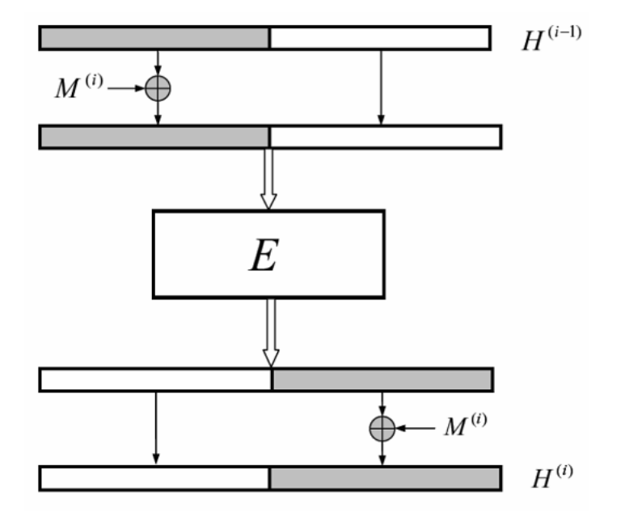
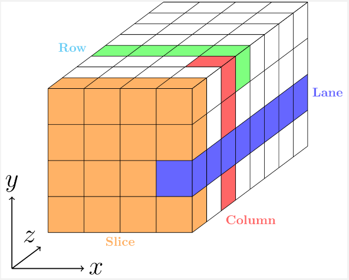
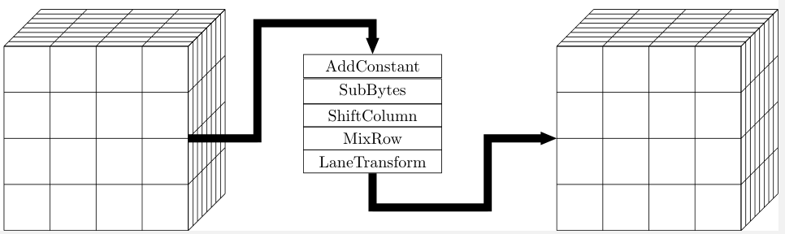
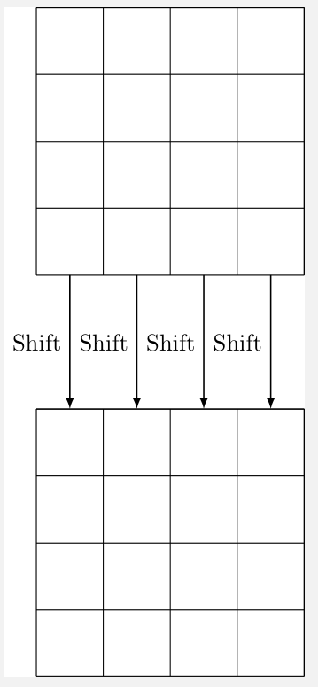

# 范围

本文本规定了一种面向字的杂凑码算法的计算方法和计算步骤。

# 术语和定义

## 位串 (bit string)

由 0 和 1 组成的二进制数字序列。

## 消息 (message)

任意有限长度的位串。本文本中消息作为杂凑算法的输入数据。

## 散列值 (hash value)

杂凑算法作用于消息后输出的特定长度的位串。本文本中的散列值长度为 256 位。

## 字 (word)

长度为 32 位的位串。

# 符号

下列符号适用于本文本。

-   $\ll k$: 循环左移$k$位运算。
-   $M^{(i)}$: 第$i$个消息块。
-   $H^{(i)}$: 第$i$次迭代之后算法的内部状态。
-   $A_{x,y,z}$: 算法内部状态$A$里位于$(x,y,z)$的元素。
-   $\bigoplus$: 一个字节的异或运算。
-   $\bigoplus_f$: 首对齐的异或运算。
-   $\bigoplus_t$: 尾对齐的异或运算。
-   A$\circ$B: 将运算$A$复合到运算$B$上。
-   $S(x)$: 使内部状态 x 经过 S 盒$S$。
-   $E$: 置换。
-   $f$: 压缩函数。

# 常数与函数

## 初始值

算法的初始值$iv$是一个全 0 的$4\times 4\times 8$立方体。立方体中每个元素都是一个字节。总长度$l = 1024$位。

## 轮数

$$t = 8$$

## 轮常数

一个 8 位整数。

$$c = 247$$

## S 盒

S 盒中的每个元素是一个十六进制整数。

$$S = \left(\begin{matrix}
63 & 7c & 77 & 7b & f2 & 6b & 6f & c5 & 30 \\ 01 & 67 & 2b & fe & d7 & ab & 76 \\
ca & 82 & c9 & 7d & fa & 59 & 47 & f0 & ad \\ d4 & a2 & af & 9c & a4 & 72 & c0 \\
b7 & fd & 93 & 26 & 36 & 3f & f7 & cc & 34 \\ a5 & e5 & f1 & 71 & d8 & 31 & 15 \\
04 & c7 & 23 & c3 & 18 & 96 & 05 & 9a & 07 \\ 12 & 80 & e2 & eb & 27 & b2 & 75 \\
09 & 83 & 2c & 1a & 1b & 6e & 5a & a0 & 52 \\ 3b & d6 & b3 & 29 & e3 & 2f & 84 \\
53 & d1 & 00 & ed & 20 & fc & b1 & 5b & 6a \\ cb & be & 39 & 4a & 4c & 58 & cf \\
d0 & ef & aa & fb & 43 & 4d & 33 & 85 & 45 \\ f9 & 02 & 7f & 50 & 3c & 9f & a8 \\
51 & a3 & 40 & 8f & 92 & 9d & 38 & f5 & bc \\ b6 & da & 21 & 10 & ff & f3 & d2 \\
cd & 0c & 13 & ec & 5f & 97 & 44 & 17 & c4 \\ a7 & 7e & 3d & 64 & 5d & 19 & 73 \\
60 & 81 & 4f & dc & 22 & 2a & 90 & 88 & 46 \\ ee & b8 & 14 & de & 5e & 0b & db \\
e0 & 32 & 3a & 0a & 49 & 06 & 24 & 5c & c2 \\ d3 & ac & 62 & 91 & 95 & e4 & 79 \\
e7 & c8 & 37 & 6d & 8d & d5 & 4e & a9 & 6c \\ 56 & f4 & ea & 65 & 7a & ae & 08 \\
ba & 78 & 25 & 2e & 1c & a6 & b4 & c6 & e8 \\ dd & 74 & 1f & 4b & bd & 8b & 8a \\
70 & 3e & b5 & 66 & 48 & 03 & f6 & 0e & 61 \\ 35 & 57 & b9 & 86 & c1 & 1d & 9e \\
e1 & f8 & 98 & 11 & 69 & d9 & 8e & 94 & 9b \\ 1e & 87 & e9 & ce & 55 & 28 & df \\
8c & a1 & 89 & 0d & bf & e6 & 42 & 68 & 41 \\ 99 & 2d & 0f & b0 & 54 & bb & 16 \\
\end{matrix}\right)$$

## 列位移量

$$\varrho = \left(\begin{matrix}3 & 2 & 1 & 2\end{matrix}\right)$$

## 道变换量

$$\varphi = \left(\begin{matrix}
1 & 2 & 1 & 3 \\
2 & 3 & 2 & 1 \\
3 & 1 & 2 & 1 \\
2 & 1 & 3 & 1 \\
\end{matrix}\right)$$

## MDS 矩阵

MDS 矩阵中的每个元素都位于$\mathbb{F}^{2^8}$的有限域上。模多项式为$x^8 + x^7 + x^5 + x^4 + 1$

$$M = \left(\begin{matrix}
1 & 1 & 2 & 4 \\
1 & 2 & 4 & 1 \\
2 & 4 & 1 & 1 \\
4 & 1 & 1 & 2 \\
\end{matrix}\right)$$

## 摘要长度

$$n = 64$$

# 算法描述

## 整体结构和压缩函数

杂凑函数是由压缩函数迭代构 **一种面向字的杂凑密码设计方案** 成的。首先对消息 $M$ 进行填充，填充后获得 $512$ 位倍数的消息，将其分割为若干个 $512$ 位的消息块$M^{(i)},i = 1,\dots,t$。初始值$H^{(0)} = iv$，处理消息块过程为：

$$ H^{(i)} \gets f(H^{(i -1)}, M^{(i)}), i = 1,\dots, t$$

因此，压缩函数将一个长度为 1024 位的内部状态$H^{(i-1)}$和一个长度为 512 位的输入$M^{(i)}$映射到一个 1024 位的输出$H^{(i)}$。处理完消息块后对最后得到的内部状态$H^{(t)}$做输出变换得到最终的散列值。输出变换记为$\Omega$，因此$H(M) = \Omega(H^{(t)})$。

压缩函数是一个双射函数，其中$E$是一个置换

定义为：

$$\textstyle f(H,M) = E(H\bigoplus_f M)\bigoplus_t M$$

## 置换函数

置换函数的状态设置为$4\times 4\times 8$构成的立方体，每个方块大小为$8$位，总体状态大小为$1024$位。将整个状态记为$A$，那么$A_{x,y,z}(0\leq x\leq 3, 0\leq y \leq 3, 0\leq z\leq 7)$代表其中一个字节。状态中橙色的切片 (slice) 用$A_{x,y,0}(0\leq x\leq 3, 0\leq y, \leq 3)$来表示，绿色的行 (row) 用$A_{x,3,3}(0\leq x\leq 3)$表示，红色的列 (column) 用$A_{3,y,2}( 0\leq y \leq 3)$表示，蓝色的道 (lane) 用$A_{3,1,z}(0\leq z\leq 7)$表示。

置换$E$由以下五个组件构成，分别是轮常数加、字节替代（S 盒）、列移位、行混淆、道变换，我们将它们分别记为轮常数加：$AC$、字节替代：$SB$、列移位：$SC$、行混淆：$MR$和道变换：$LT$。因此输入状态$A$经过置换得到输出$B$定义为：

$$B = LT\circ MR\circ SC\circ SB\circ AC(A)$$

如下图所示：

### 非线性组件

字节替代是杂凑函数中唯一的非线性变换，定义为：

$$ A_{x,y,z} = S(A_{x,y,z}), 0\leq x\leq 3, 0\leq y \leq 3, 0\leq z\leq 7$$

选用了与 ZUC 杂凑函数中相同的 S 盒。选择这个变换的原因如下：
- 大小：8 位 S 盒在实现方面是方便的权衡选择（在流行平台上是最小的字长），同时也考虑了密码分析方面的因素。另一方面，可以选择$2^8!$种不同的置换。
- 单一 S 盒而不是许多不同的 S 盒：这再次是实现和密码分析方面的权衡选择。
- 没有随机 S 盒：结构化的 S 盒 比随机 S 盒 允许更高效的硬件实现。
- 由于 S 盒是从 ZUC 继承而来，实现方面的特点（特别是在硬件方面）得到了深入研究。

### 线性组件

#### 列移位：

列移位是在每一个 Slice 上进行的，定义为：

$$ A_{x,y,z} = (A_{x,(y << \varrho_{x}),z}), 0\leq x\leq 3, 0\leq y \leq 3, 0\leq z\leq 7$$

其中$\varrho_{x}$表示的是每一列所要循环移位的参数。

#### 行混淆

行混淆参考 Keccak 的设计思路，对不同维度的行进行混淆。将 MDS 矩阵记为$M$，那么行混淆操作定义为：

$$ A_{x,y,z} = M(A_{x,(y+1\pmod{4}),(z-1\pmod{7})}), 0\leq x\leq 3, 0\leq y \leq 3, 0\leq z\leq 7$$

#### 道变换

在道上做循环移位操作，定义为：

$$ A_{x,y,z} = (A_{x,y,(z \ll \varPhi_{x,y})}), 0\leq x\leq 3, 0\leq y \leq 3, 0\leq z\leq 7$$

其中$\varPhi_{x,y}$表示每一个道的循环移位参数。移位参数同样使用类似于列移位使用自动化搜索技术获得。

#### 轮常数加

轮常数加在每个字上进行，定义为：

$$ A_{x,y,z} = A_{x,y,z}\bigoplus c, 0\leq x\leq 3, 0\leq y \leq 3, 0\leq z\leq 7$$

其中$c$表示轮常数，为一个 8 位的整数。

## 输出变换

输出变换$\Omega$定义为：$\Omega(x) = trunc_n(f(x)\bigoplus x)$。其中$trunc_n(x)$是一个截断操作，表示将 $x$ 中的前 $n$ 位保留，其余部分丢弃。需要注意的是，由于使用置换函数作为压缩函数，所以$l\geq 2n$。
